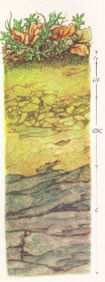

```{r setup, include=FALSE}
knitr::opts_chunk$set(echo = TRUE,
                      collapse = TRUE,
                      message = FALSE,
                      warning = FALSE,
                      error = FALSE)
```

# soilprofile2 

With this application the parameters from the R-package ["soilprofile 2"](https://github.com/nardusstricta/soilprofile2) can be adjusted with a graphical user interface. The package and the description of the individual parameters are available on github or in the package description. In following the inserted readme:

A package for R that provides the graphical representation of [soil horizons](https://en.wikipedia.org/wiki/Soil_horizon), in the simplest case the color. The focus is on morphological properties such as horizon transitions, texture, structure, root density, and rock content. Soil-forming processes can also be represented with uniform symbols, for example different hydromorphic soils characteristics. Some designations are based on the [German soil mapping instructions](https://de.wikipedia.org/wiki/Bodenkundliche_Kartieranleitung). The package was written as part of my master thesis at the [Chair of Soil Ecology](http://www.bodenkunde.uni-freiburg.de/index_html-en?set_language=en) of the University of Freiburg.  


## Installation
The package is currently only available on Github 
```{r installation}
#install the development version from github with
#install.packages("devtools")
#devtools::install_github("nardusstricta/soilprofile2")
```

## Usage
Morphological data collected in the field, such as horizon boundaries, root frequency and dimensions, skeleton shape, frequency and dimension as well as meaningful soil colours, can be visualised by using different layers.To create and calculate the geometries the Simple Feature Access is used which is integrated in the package [sf](https://github.com/r-spatial/sf). The data management is done with dplyr [dplyr](https://cran.r-project.org/web/packages/dplyr/vignettes/dplyr.html). For the smoothing of geometries the "Kernel smoothing" algorithm from the Smoothr package [smoothr](https://github.com/mstrimas/smoothr) is used. To convert the colors (from Munsell to rgb) the fuction from the package [soil](https://cran.r-project.org/web/packages/aqp/index.html) is applied.

### Data pre-processing

```{r data_eample, dpi = 144}
#load packages:
library(dplyr)
library(soilprofile2)
library(ggplot2)


#create an example dataset and modify the color and depths 
df_example <- data.frame(name = c("Ah", "Bvh", "BvCv"),
                         depth = c("0-15", "15-43.4", "43.4-70"),
                         col = c("7.5YR 2/1","10YR 4/3", "2.5Y 5/3"),
                         skel_dim = c(".1-.8","1-2", "2-3"),
                         skel_ab = c(0.2, 0.4, .9),
                         clay = c(0, .8, 0),
                         silt = c(0, .5, .5),
                         sand = c(0, .2, .5)) %>% 
  data_mod()

#set coordinates, four points on each horizon 
cord_example  <-  cord_setting(df_example, plot_width = 2)

#create a simple feature: each line represents a horizon 
#with one polygon as geometry.
sf_example <- sf_polygon(df_geom = cord_example,
                         df_attri = df_example)
#this data is stored in the package 
#as example datan (data("soil_example_sf"))
```

### Plot
In a simplest case we plot the color into the respective geometries 
```{r plot_eample, dpi = 144}
sf_example %>% 
  ggplot() +
  geom_sf(fill = sf_example$rgb_col) +
  soil_theme()
```

### Modification of the horizon geometries 

First we create a new line between each horizon and split the entire profile with this line. 

```{r data_mod, dpi = 144}
lattri_example <- data.frame(name= c(1,2,3),
                             numberX = c(3, 6, 6),
                             sd = c(.3, .5, 1), 
                             # change it from c(.3, .5, 1) to c(1, 3, 1)
                             sm = c(TRUE, TRUE, FALSE)
)

line_example <- line_mod(df = cord_example,
                         line_attri = lattri_example)

example_profile <- split_polygon(polygon = sf_example,
                                 line = line_example)

example_profile %>%
  ggplot() +
  geom_sf(fill = example_profile$rgb_col) +
  soil_theme()

```

Secondly, we can modify the profile so that the horizon polygons mix, i.e. a single horizon consists of a multipolygon.
 
```{r trasiton, dpi = 144}

df_smooth <- data.frame(
  buffer_size = c(5), #from 5 to 4
  buffer_number = c(60),  #from 30 to 300
  nSides = c(10), #from 10 to 50
  rate = c(.6), # from 12 to 40 
  #and with shape  from .1 to .6
  name = c(3)
)

#Applying the function
smooth_profile <- smooth_trans(lmod = line_example,
                               shape_mod = example_profile,
                               attr_df = df_smooth, 
                               smoothness = 3, 
                               shape = 1) #von 12 auf .1
#Plot the result:
smooth_profile %>%
  ggplot() +
  geom_sf(fill = smooth_profile$rgb_col) +
  soil_theme()

```

### Rock content
We create a new layer for the rock content. Beside the basic information (dimension and abundance) we can add the following parameters, which are explained in detail in the function description (?soilprofile2::skeleton)
```{r rock, dpi = 144}

skeleton_mat <- data.frame(
  name = c(1, 2, 3),
  nSides = c(4, 13, 20),
  smooth = c(T, T, T), 
  union = c(T, F, T), 
  strat = c(F, T, F), 
  cellnumber = c(0, 18, 0),
  rotation = c(0, 20, 0), 
  phi = c(0, 0, 0)
)

spoint <- skeleton(shape_mod = sf_example, 
                   skeleton_mat = skeleton_mat)
#Plot the result:
sf_example %>%
  ggplot() +
  geom_sf(fill = sf_example$rgb_col) +
  geom_sf(data = spoint) +
  soil_theme()

```

### Root

We can also create our own layer for the roots. Here we can define the points from which the roots should be drawn, the length of the roots and the length variation. 
 

```{r roots, dpi = 144}
root_example <- basic_random_line(polygon = smooth_profile[1,],
                            number = 800,
                            line_length = .5, 
                            variation = .4,
                            smoothness = 5)

smooth_profile %>%
  ggplot() +
  geom_sf(fill = smooth_profile$rgb_col) +
  geom_sf(data = spoint) +
  geom_sf(data = root_example, 
          size = root_example$id/max(root_example$id), 
          col = "orange4") + #specifying the color
  soil_theme()
```

### Texture
The texture is the vector layer of the package. There are three options for the user:

   1. we have no information about the texture, but we still want a pattern. For example for the delimitation of horizons in a monochrome display. In this case, the function will create random line patterns for each horizon. 
   2. We have information (size and variation) about the texture. Then a point grid is drawn in each horizon. This can also be done with the soil color.
   3. We want a special horizon pattern. Then we can write our own function to create the desired pattern. A useful tool for this are the functions with the prefix basic_ . 
  
The three options are hierarchically structured: whenever there is a specific function, it will always be preferred. If there is information about the texture, a random pattern will never be created.  

If we don't want a black and white representation and to adjust the size of the texture points we have to use the function "par_default" to adapt the standard graphic parameters. 
```{r textur, dpi = 144}
## creation of the patterns
texture_example <- apply_texture(shape = example_profile,
                                 buffer = -1, 
                                 background = c(T, T, T)
                                 )
##set dafault aesthetics
texture_par <-  par_default(texture_example)

## plotting data
texture_par %>%
  ggplot() +
  geom_sf(fill = texture_par$bgc,
          col = texture_par$col,
          shape = texture_par$pch,
          linetype = texture_par$linetype, 
          size = texture_par$size) +
  soil_theme()

```


### Structure
For the [soil structure](https://en.wikipedia.org/wiki/Soil_structure) we need a photo (png) with the contours. This will be converted into a monochrome vector geometry and can be plotted into the corresponding horizon. As an example two photos are stored in the package. Let's take a look:

```{r structure, dpi = 144}
#first we need a path to our png file 
str_Bvh <- system.file("extdata", "broeckel.png", package = "soilprofile2")
str_BvCv <- system.file("extdata", "prismen.png", package = "soilprofile2")

#Then we put the first structure into the second horizon
#and the second into the third. 
str_all <- multiple_png(sf_example[c(2,3), ], c(str_Bvh, str_BvCv))

#plot the result 
sf_example %>% 
  ggplot() +
  geom_sf(fill = sf_example$rgb_col) +
  geom_sf(data = str_all, fill = "black") +
  soil_theme()

```

### Soil forming processes

If we want to represent specific [soil forming processes](https://en.wikipedia.org/wiki/Pedogenesis), it gets a little more complicated. That means we need a few more lines of code. The core function (process_layer) takes a numeric vector of length four, with xmin, ymin, xmax and ymax values. In this area the process symbols are to be drawn, the number is specified with the parameter "number". Additionally, the following parameters can be defined: a buffer to the horizon border and any number of layers on which no symbol should be drawn. The function x returns points layer. We can combine this with a list of defined symbols by name. This is stored in the folder data (data("process_symbols")). 
Let's give an example:
```{r processes , dpi = 144}
#create the vector
poly2 <- sf::st_bbox(soil_example_sf$geometry[2]) 
#apply the fuction 
point2 <- process_layer(poly2, number = 5, buffer = 3) %>% 
  #for each point one row:
  sf::st_cast("POINT") %>%
  #drag random example symbols from the table included in the package.  
  sf::st_sf(name = sample(process_symbols$name, 
                          length(.), replace = TRUE)) %>% 
  #get the aestetic parameters by a join. 
  dplyr::left_join(process_symbols, by = "name")

#plotting
soil_example_sf %>% 
  ggplot() +
  geom_sf(fill = soil_example_sf$rgb_col) +
  geom_sf(data = point2, 
          shape = point2$shape, 
          color = point2$color, 
          fill = point2$fill, 
          stroke = point2$stroke) +
  soil_theme()
```

If we want a legend we can call the function "soil_legend". But before we can do that we have to make sure that no symbols are double or missing.  
```{r processes2, dpi = 144}
#legend:
df_legend <- data.frame(name = unique(point2$name)) %>% 
  left_join(process_symbols, by = "name")

#plotting:

soil_legend(df_legend)

```

Suppose we have already plotted the skeleton content and now want to add water symbols. Then we have to add the skeleton content to the function "process_layer". Otherwise we do exactly the same as before.

```{r processes3, dpi = 144}
#reduce the rock abundanz
soil_example_sf$skel_ab[3] <- 0.2

#define the rock parameter form horizont 3:
skeleton_mat <- data.frame(
  name = c(3),
  nSides = c(20),
  smooth = c(TRUE),
  union = c(TRUE),
  strat = c(FALSE),
  cellnumber = c(0),
  rotation = c(0),
  phi = c(0)
)
#apply skeleton function
spoint <- skeleton(shape_mod = soil_example_sf,
                   skeleton_mat = skeleton_mat)
#create the bbox vector:
poly3 <- sf::st_bbox(soil_example_sf$geometry[3])
point3 <- process_layer(poly3, number = 7, 
                        buffer = 1.5, layer1 = spoint) %>% 
  #define symbols
  sf::st_sf(name = "Wasser") %>% 
  dplyr::left_join(process_symbols, by = "name")

#and plotting...
soil_example_sf %>% 
  ggplot() +
  geom_sf(fill = soil_example_sf$rgb_col) +
  geom_sf(data = point3, 
          shape = point3$shape, 
          color = point3$color, 
          fill = point3$fill, 
          stroke = point3$stroke,
          size = 3) +
  geom_sf(data = spoint) +
  soil_theme()

```

### Photoimport

Let's assume we have an extraordinarily good photo that represents the horizon better than any other attempt. Then we can add the photo to the soil profile. Of course it can also be a photo from a drawing or a Photoshop project. In the package we have one example file:


```{r PNG, dpi = 144}
#get the path
photo_Ah_path <- system.file("extdata", "photo_example.png", 
                             package = "soilprofile2")

#mask an extent the photo tho the first horizont:
photo_Ah <- png_import(photo_Ah_path, sf_example[1,], raster2polygon = F)
#plot the result:
sf_example %>% 
  ggplot() +
  geom_sf(fill = sf_example$rgb_col) +
  geom_sf(data = str_all, fill = "black") +
  ggspatial::layer_spatial(photo_Ah) +
  soil_theme()

```